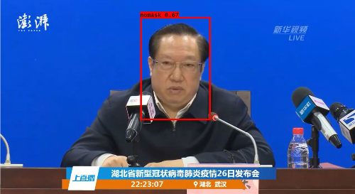
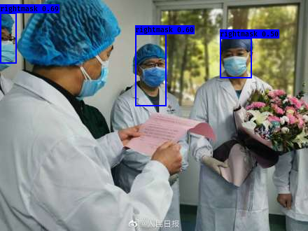

# MaskDetect  

基于深度学习的口罩佩戴检测，Keras-YOLOv3 实现。  

## Preview  

  

  

## 测试  

### 下载模型文件  

模型文件存储在百度云上：[MaskDetect_model（提取码: yphs）](https://pan.baidu.com/s/1L9g8dvM8tn0wZkHM47lsfw)  

模型文件对应说明如下：  
| 模型文件                        | 说明           |  
|-----------------------------|--------------|  
| trained\_weights\_final\.h5 | 经过训练的模型      |  
| yolo\_weights\.h5           | YOLO 官方预训练模型 |  

下载后，请将模型文件放在 `model_data` 目录下。  

### 开始测试  

对于图片：`python3 yolo_video.py [OPTIONS...] --image`  

对于视频：`python3 yolo_video.py [video_path] [output_path (optional)]`  

`yolo_video.py` 完整的选项可以通过 `python3 yolo_video.py --help` 查看。  

## 训练  

### 准备数据集  

你需要按照 VOC 数据集的格式准备数据集，`VOC_data/VOC_mask` 目录用于存放数据。  

```sh  
VOC_mask  
    ├─data_list # 存放数据集列表文件，建议由 create_dataset.py 生成  
    ├─img # 存放图片文件  
    ├─label # 存放图片标签，xml 格式  
    └─test_img # 存放了两个样例，与训练无关。  
```  

### 处理数据并生成索引  

`VOC_data/VOC_mask` 目录下的 `data_proc.py` 可以帮助处理数据集，完成统一命名和数据对应，如果数据集格式本身就规范，则没有必要使用它。  

将图片放入 `img` 目录，将标签放入 `label` 目录之后，运行 `VOC_data/VOC_mask` 目录下的 `create_dataset.py`，该程序将在 `data_list` 目录下生成 `test.txt` `train.txt` `trainval.txt` `val.txt` 这四个列表文件。  

在根目录下，运行 `voc_annotation.py`，程序将在根目录下生成用于训练的数据列表。  

### 开始训练  

在根目录下，运行 `train.py` 进行训练。可以根据情况修改 `train.py` 中的参数。  

## 细节  

### 环境  

训练及测试的环境如下：  

* **Python:** 3.6.9  
* **Keras:** 2.2.0  
* **TensorFlow:** 1.6.0  

### 数据集  

训练使用的数据集：[hikariming/virus-mask-dataset](https://github.com/hikariming/virus-mask-dataset)  
数据集分为三个类：正确佩戴口罩（rightmask）、错误佩戴口罩（wrongmask）、未佩戴口罩（nomask）。经过数据清洗后，剩余 147 个有效样本用于训练和评估。  

### 训练  

考虑迁移学习，在 YOLO 官方预训练的权重上继续训练 100 轮，loss 降至 23 左右。  

### 不足  

用于训练的数据规模并不是很大，达到的训练效果比较有限，实测还是存在比较多的漏测现象，尤其是对 rightmask 和 wrongmask 的区分效果不是很好。如果有更大规模的数据集用于训练应该会有更好的效果。  

## 引用及致谢  

训练使用了 hikariming 公开的口罩检测数据集：[hikariming/virus-mask-dataset](https://github.com/hikariming/virus-mask-dataset)  

Keras-YOLOv3 框架来自：[qqwweee/keras-yolo3](https://github.com/qqwweee/keras-yolo3)  

在此表示感谢！  